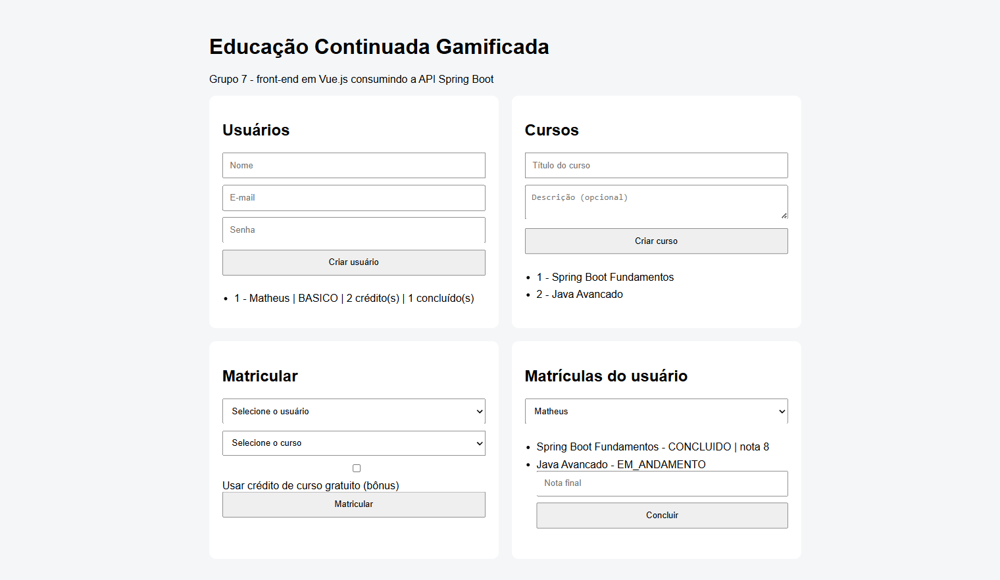
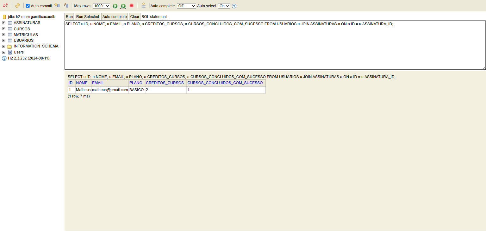
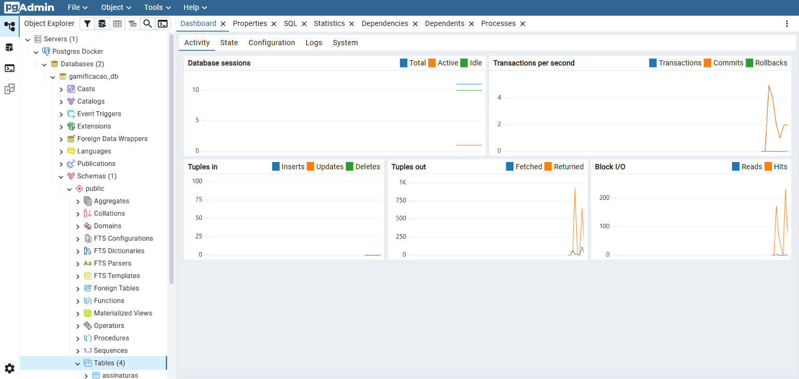
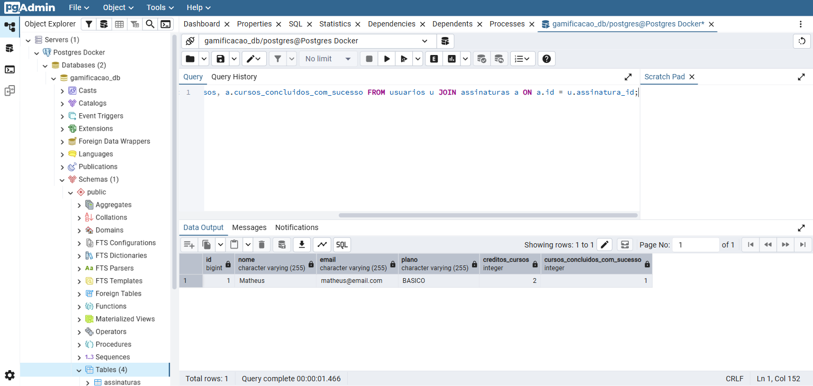
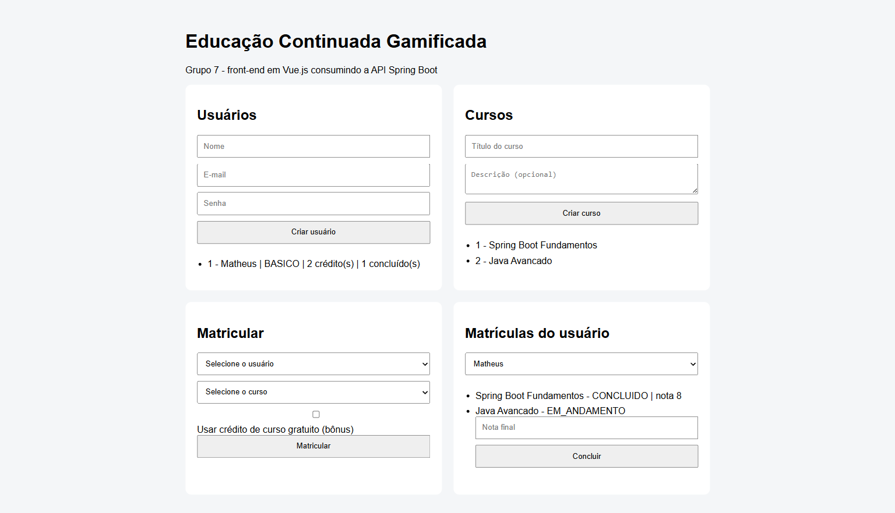

# Educação Continuada Gamificada — Grupo 7

Projeto final de ATDD (BDD + TDD) com Spring Boot, desenvolvido a partir do estudo de caso
**Gamificação para Engajamento de Educação Continuada**.

| | |
|---|---|
| **Integrantes** | Matheus de Alcantara, Henrique, Rafael |
| **Stack** | Java 17, Spring Boot 3.5.5, Spring Data JPA, H2, PostgreSQL, Vue.js 3 |
| **Testes** | JUnit 5 + JaCoCo (100% de cobertura do domínio) |
| **Infra** | Docker, Docker Compose, pgAdmin, GitHub Actions |

---

## 1. Descrição do estudo de caso

**GAMIFICAÇÃO PARA ENGAJAMENTO DE EDUCAÇÃO CONTINUADA**

Uma determinada plataforma vende cursos online e EAD no modelo de assinaturas. O aluno paga um
valor mensal e tem acesso a um conjunto de cursos para assinatura básica. A cada curso terminado
e com média acima de 7,0, o aluno tem direito a realização de mais 3 cursos. O aluno que escrever
mais tópicos no fórum e ajudar outros participantes com seus comentários, ganha um curso no final
do mês. Quando o aluno conquistar 12 cursos, seu plano de assinatura passa a ser "Premium" e ele
passa a receber voucher para participar de projetos reais, durante os cursos, e receber 3 moedas,
que podem ser convertidas em conhecimento (novos cursos), acumular ou receber por criptomoeda.

---

## 2. User Stories — uma por integrante

As três US estão versionadas na planilha [Tabela_US_BDD_TDD.xlsx](Tabela_US_BDD_TDD.xlsx), aba `pb`.

| # | Redigida por | User Story |
|---|---|---|
| US1 | **Matheus de Alcantara** | COMO Usuário/Aluno, QUERO visualizar quais cursos tenho acesso no meu plano atual, PARA acessá-los e realizá-los. |
| US2 | **Henrique** | COMO Usuário/Aluno, QUERO visualizar as notas médias dos meus cursos concluídos, PARA verificar se tenho direito a mais 3 cursos gratuitos. |
| US3 | **Rafael** | COMO Usuário/Aluno, QUERO visualizar a quantidade de cursos concluídos, PARA verificar meu progresso da melhoria gratuita para o plano Premium. |

### US escolhida para implementação

> **US2 — Henrique**
> *COMO Usuário/Aluno, QUERO visualizar as notas médias dos meus cursos concluídos,
> PARA verificar se tenho direito a mais 3 cursos gratuitos.*

Foi a escolhida porque é a que concentra a regra central do estudo de caso: **curso concluído com
nota maior ou igual a 7 dá direito a mais 3 cursos**. Os seis cenários BDD partem dessa regra —
quatro tratam de ganhar e guardar créditos, e dois tratam de gastá-los ao desbloquear um curso.

---

## 3. Cenários BDD — dois por integrante

| Cenário | Escrito por | BDD |
|---|---|---|
| **1** | **Matheus de Alcantara** | **Dado** um curso concluído<br>**E** a nota do usuário para aquele curso é >= 7<br>**Quando** este curso é finalizado<br>**Então** mais 3 créditos de curso gratuito devem ser acrescentados para o usuário |
| **2** | **Matheus de Alcantara** | **Dado** um curso concluído<br>**E** a nota do usuário para aquele curso é < 7<br>**Quando** este curso é finalizado<br>**Então** nenhum crédito de curso gratuito é adicionado para o usuário |
| **3** | **Rafael** | **Dado** um curso em andamento<br>**Quando** existe apenas 1 curso em andamento<br>**E** não existe nenhum curso finalizado pelo usuário<br>**Então** o usuário deve ter 0 créditos de curso gratuito |
| **4** | **Rafael** | **Dado** um curso em andamento<br>**E** a média parcial deste curso é >= 7<br>**Quando** o curso ainda não foi finalizado<br>**Então** nenhum crédito de curso gratuito é adicionado para o usuário |
| **5** | **Henrique** | **Dado** um curso não adquirido<br>**E** o usuário possui >= 1 crédito de curso gratuito<br>**Quando** o usuário solicitar o desbloqueio deste curso<br>**Então** este curso é liberado e adicionado à biblioteca de cursos do usuário<br>**E** um crédito de curso gratuito é consumido |
| **6** | **Henrique** | **Dado** um curso não adquirido<br>**E** o usuário possui < 1 crédito de curso gratuito<br>**Quando** o usuário solicitar o desbloqueio deste curso<br>**Então** este curso não é liberado nem adicionado à biblioteca de cursos do usuário<br>**E** um aviso de "créditos insuficientes" é exibido ao usuário |

Cada cenário virou um teste JUnit na pasta de domínio:

| Cenários | Classe de teste |
|---|---|
| 1 e 2 | [ConclusaoCursoTest.java](src/test/java/org/example/grupo_7_praticaatdd/domain/ConclusaoCursoTest.java) |
| 3 e 4 | [CursoEmAndamentoTest.java](src/test/java/org/example/grupo_7_praticaatdd/domain/CursoEmAndamentoTest.java) |
| 5 e 6 | [DesbloqueioCursoTest.java](src/test/java/org/example/grupo_7_praticaatdd/domain/DesbloqueioCursoTest.java) |

---

## 4. Ciclo TDD — RED, GREEN, BLUE

O ciclo foi feito cenário a cenário, e cada passo tem commit próprio no histórico do Git.
Os prints estão em [printsTestes/](printsTestes/), separados por integrante.

### RED — testes escritos primeiro, falhando

| Integrante | Cenários | Evidência |
|---|---|---|
| Matheus de Alcantara | 1 e 2 | [IntelliJ](printsTestes/cenarios-01-02-alcantara/01-red-intellij.png) · [GitHub Actions](printsTestes/cenarios-01-02-alcantara/02-red-actions.png) |
| Rafael | 3 e 4 | [IntelliJ](printsTestes/cenarios-03-04-rafael/01-red-intellij.png.png) · [GitHub Actions](printsTestes/cenarios-03-04-rafael/02-red-actions.png.png) |
| Henrique | 5 e 6 | [IntelliJ](printsTestes/cenarios-05-06-henrique/01-red-intellij.png) · [GitHub Actions](printsTestes/cenarios-05-06-henrique/02-red-actions.png) |

### GREEN — implementação mínima até os testes passarem

| Integrante | Cenários | Evidência |
|---|---|---|
| Matheus de Alcantara | 1 e 2 | [IntelliJ](printsTestes/cenarios-01-02-alcantara/03-green-intellij.png) · [GitHub Actions](printsTestes/cenarios-01-02-alcantara/04-green-actions.png) |
| Rafael | 3 e 4 | [IntelliJ](printsTestes/cenarios-03-04-rafael/03-green-intellij.png.png) · [GitHub Actions](printsTestes/cenarios-03-04-rafael/04-green-actions.png.png) · [JaCoCo](printsTestes/cenarios-03-04-rafael/05-green-jacoco.png.png) |
| Henrique | 5 e 6 | [IntelliJ](printsTestes/cenarios-05-06-henrique/03-green-intellij.png) · [GitHub Actions](printsTestes/cenarios-05-06-henrique/04-green-actions.png) · [JaCoCo](printsTestes/cenarios-05-06-henrique/05-jacoco-green.png) |

Nesta fase a cobertura ainda tinha amarelo e vermelho, como mostram os prints do JaCoCo.

### BLUE — refatoração com os testes passando e cobertura em 100%

Refatorações feitas nesta fase:

- extração das constantes `NOTA_MINIMA_APROVACAO` e `CREDITOS_POR_CONCLUSAO`;
- centralização da mensagem `MENSAGEM_CREDITOS_INSUFICIENTES`;
- extração do método `estaEmAndamento()` na `Matricula`;
- encapsulamento de nome, e-mail, senha, título e descrição em **Value Objects**.

| Integrante | Cenários | Evidência |
|---|---|---|
| Matheus de Alcantara | 1 e 2 | [IntelliJ](printsTestes/cenarios-01-02-alcantara/05-blue-intellij.png) · [GitHub Actions](printsTestes/cenarios-01-02-alcantara/06-blue-actions.png) |
| Rafael | 3 e 4 | [IntelliJ](printsTestes/cenarios-03-04-rafael/06-blue-intellij.png.png) · [JaCoCo](printsTestes/cenarios-03-04-rafael/07-blue-jacoco.png.png) |
| Henrique | 5 e 6 | [IntelliJ](printsTestes/cenarios-05-06-henrique/06-blue-intellij.png) |

**Resultado final: 43 testes, 100% de cobertura, sem vermelho nem amarelo.**


Para conferir localmente:

```bash
./mvnw clean test
```

> **Escopo da medição:** o TDD foi aplicado sobre o domínio, então o relatório mede o domínio.
> As camadas de infraestrutura (`controller`, `service`, `repository`, `dto`, `config` e a classe
> `Application`) estão declaradas em `<excludes>` no JaCoCo, porque são testadas manualmente pelo
> Swagger e pelo front-end, e não por testes unitários.

---

## 5. Arquitetura em camadas

```text
Front-end Vue.js / Swagger / Postman
              |
              v
          Controller        <- recebe HTTP, valida DTO, devolve JSON
              |
              v
           Service          <- regra de negócio, @Transactional, converte para DTO
              |
              v
         Repository         <- Spring Data JPA
              |
              v
     Domain (@Entity + VO)  <- regras do negócio, testadas via TDD
              |
              v
       H2 / PostgreSQL
```

| Camada | Pacote | Classes |
|---|---|---|
| Domain | [domain/](src/main/java/org/example/grupo_7_praticaatdd/domain/) | `Usuario`, `Assinatura`, `Curso`, `Matricula`, `PlanoAssinatura`, `StatusMatricula` |
| Value Objects | [domain/VO/](src/main/java/org/example/grupo_7_praticaatdd/domain/VO/) | `NomeUsuario`, `EmailUsuario`, `SenhaCriptografada`, `TituloCurso`, `DescricaoCurso` |
| Repository | [repository/](src/main/java/org/example/grupo_7_praticaatdd/repository/) | `UsuarioRepository`, `CursoRepository`, `MatriculaRepository` |
| DTO | [dto/](src/main/java/org/example/grupo_7_praticaatdd/dto/) | Request e Response de usuário, curso e matrícula |
| Service | [service/](src/main/java/org/example/grupo_7_praticaatdd/service/) | `UsuarioService`, `CursoService`, `MatriculaService` |
| Controller | [controller/](src/main/java/org/example/grupo_7_praticaatdd/controller/) | `UsuarioController`, `CursoController`, `MatriculaController`, `ApiExceptionHandler` |
| Config | [config/](src/main/java/org/example/grupo_7_praticaatdd/config/) | `OpenApiConfig`, `CriptografiaConfig` |

As entidades JPA ficam no próprio pacote `domain`, com `@Entity` e `@Embeddable`, seguindo o
modelo do projeto de referência passado em aula.

---

## 6. Endpoints e Swagger

Com a aplicação no ar: **http://localhost:8080/swagger-ui.html**


| Método | Rota | Descrição |
|---|---|---|
| `GET` | `/api/usuarios` | Lista os usuários |
| `GET` | `/api/usuarios/{id}` | Busca usuário e o estado da assinatura |
| `POST` | `/api/usuarios` | Cria usuário com assinatura básica |
| `GET` | `/api/cursos` | Lista os cursos |
| `POST` | `/api/cursos` | Cria um curso |
| `POST` | `/api/matriculas` | Matricula em um curso (`bonus: true` consome um crédito) |
| `PUT` | `/api/matriculas/{id}/concluir` | Conclui a matrícula com a nota final |
| `GET` | `/api/matriculas/usuario/{usuarioId}` | Lista as matrículas de um usuário |

### Fluxo sugerido para demonstrar as regras

```bash
# 1) cria o usuário (nasce BASICO, com 0 créditos)
curl -X POST http://localhost:8080/api/usuarios \
  -H "Content-Type: application/json" \
  -d '{"nome":"Matheus","email":"matheus@email.com","senha":"123456"}'

# 2) cria o curso
curl -X POST http://localhost:8080/api/cursos \
  -H "Content-Type: application/json" \
  -d '{"titulo":"Spring Boot Fundamentos","descricao":"Curso introdutorio"}'

# 3) matricula
curl -X POST http://localhost:8080/api/matriculas \
  -H "Content-Type: application/json" \
  -d '{"usuarioId":1,"cursoId":1,"bonus":false}'

# 4) conclui com nota 8 -> cenário 1: ganha 3 créditos
curl -X PUT http://localhost:8080/api/matriculas/1/concluir \
  -H "Content-Type: application/json" \
  -d '{"notaFinal":8.0}'

# 5) confere os créditos
curl http://localhost:8080/api/usuarios/1

# 6) matrícula bônus -> cenário 5: consome um crédito
curl -X POST http://localhost:8080/api/matriculas \
  -H "Content-Type: application/json" \
  -d '{"usuarioId":1,"cursoId":1,"bonus":true}'
```

Sem crédito, a API devolve **HTTP 400** com o aviso do cenário 6:

```json
{ "erro": "Creditos insuficientes", "status": 400 }
```

---

## 7. Front-end em Vue.js

Servido pela própria aplicação em **http://localhost:8080/index.html**
([index.html](src/main/resources/static/index.html)).

Usa Vue 3 via CDN e consome os endpoints REST. Dá para criar usuário e curso, matricular,
concluir com nota e ver os créditos e o plano mudarem na tela.



---

## 8. Como executar

### Opção A — Docker (aplicação + PostgreSQL + pgAdmin)

```bash
docker compose up --build
```

| Serviço | Endereço | Acesso |
|---|---|---|
| Aplicação | http://localhost:8080 | — |
| Swagger | http://localhost:8080/swagger-ui.html | — |
| PostgreSQL | `localhost:5432` | banco `gamificacao_db`, usuário `postgres`, senha `postgres` |
| pgAdmin | http://localhost:5050 | `admin@admin.com` / `admin` |

Para registrar o servidor no pgAdmin, use **Host: `postgres`** (é o nome do serviço dentro da
rede do Compose — não use `localhost`), porta `5432`, banco `gamificacao_db`, usuário e senha
`postgres`.

### Opção B — local com H2 em memória

```bash
./mvnw spring-boot:run -Dspring-boot.run.profiles=h2
```

Console do H2 em **http://localhost:8080/h2-console**, com JDBC URL `jdbc:h2:mem:gamificacaodb`,
usuário `sa` e senha em branco.

### Opção C — local com PostgreSQL

O profile padrão é `postgres`. Basta ter o banco `gamificacao_db` disponível em
`localhost:5432` e rodar:

```bash
./mvnw spring-boot:run
```

As credenciais podem ser sobrescritas por variáveis de ambiente: `SPRING_DATASOURCE_URL`,
`SPRING_DATASOURCE_USERNAME` e `SPRING_DATASOURCE_PASSWORD`.

---

## 9. Evidências dos bancos

### H2

Console do H2 mostrando o usuário persistido com os 3 créditos ganhos ao concluir o curso
com nota 8:



```sql
SELECT u.ID, u.NOME, u.EMAIL, a.PLANO, a.CREDITOS_CURSOS, a.CURSOS_CONCLUIDOS_COM_SUCESSO
FROM USUARIOS u JOIN ASSINATURAS a ON a.ID = u.ASSINATURA_ID;
```

### PostgreSQL via Docker

A stack foi executada com `docker compose up --build`, subindo os três containers:
aplicação, PostgreSQL e pgAdmin. As tabelas foram criadas pelo JPA e o fluxo do estudo de
caso foi executado pela API contra o PostgreSQL.

A saída completa do terminal está em
[docker-compose-evidencia.txt](evidencias/docker-compose-evidencia.txt):

```text
NAME                   IMAGE              STATUS                    PORTS
gamificacao-app        projeto-app        Up 11 minutes             0.0.0.0:8080->8080/tcp
gamificacao-pgadmin    dpage/pgadmin4:9   Up 11 minutes             0.0.0.0:5050->80/tcp
gamificacao-postgres   postgres:16        Up 11 minutes (healthy)   0.0.0.0:5432->5432/tcp
```

**pgAdmin conectado no container do PostgreSQL, com as 4 tabelas criadas pelo JPA:**



**Consulta no pgAdmin mostrando o usuário com os créditos ganhos:**



```sql
SELECT u.id, u.nome, u.email, a.plano, a.creditos_cursos, a.cursos_concluidos_com_sucesso
FROM usuarios u JOIN assinaturas a ON a.id = u.assinatura_id;
```

**Front-end Vue servido pelo container da aplicação, com os dados vindos do PostgreSQL:**



Outras consultas úteis no pgAdmin:

```sql
SELECT * FROM usuarios;
SELECT * FROM assinaturas;
SELECT * FROM cursos;
SELECT * FROM matriculas;
```

---

## 10. Testes e integração contínua

```bash
./mvnw clean test     # roda os 43 testes e gera o relatorio de cobertura
```

O workflow [testes.yml](.github/workflows/testes.yml) roda a cada push e pull request,
executa os testes e publica os relatórios do Surefire e do JaCoCo como artefatos.

### Estrutura dos testes

| Classe | O que cobre |
|---|---|
| `ConclusaoCursoTest` | Cenários BDD 1 e 2 |
| `CursoEmAndamentoTest` | Cenários BDD 3 e 4 |
| `DesbloqueioCursoTest` | Cenários BDD 5 e 6 |
| `UsuarioTest`, `CursoTest`, `MatriculaTest`, `AssinaturaTest` | Regras e estado das entidades do domínio |
| `NomeUsuarioTest`, `EmailUsuarioTest`, `SenhaCriptografadaTest`, `TituloCursoTest`, `DescricaoCursoTest` | Validações dos Value Objects |
| `Grupo7PraticaAtddApplicationTests` | Sobe o contexto Spring |
